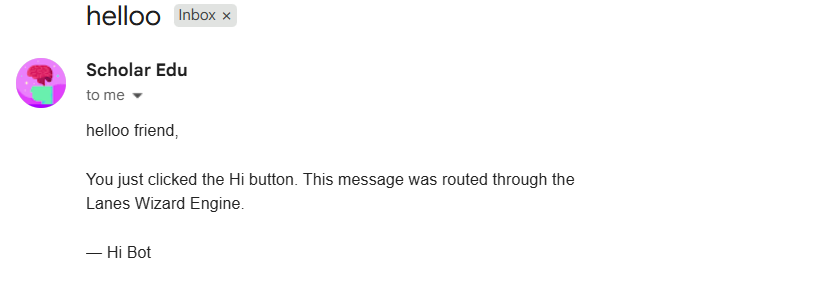

# 👋 Hi Bot

> The smallest possible production workflow built with `lanes-engine`.

Hi Bot is a tiny example application that demonstrates how to build real-world automations with `lanes-engine`.

A user action enters the Wizard runtime, is routed through a lane, and performs a real action: sending an email.

This project exists to answer one question:

> **"What can I actually build with lanes-engine?"**

The answer is:

> **Production workflows with surprisingly little code.**

---

# ✨ Features

- ⚡ Built on `lanes-engine`
- 📨 Sends real emails
- 🛣️ Demonstrates lane routing
- 🧙 Uses the Wizard runtime
- 🧩 Minimal and easy to understand
- 🚀 Great starting point for your own bots and automations

---

# Workflow

```text
User Action
      │
      ▼
 Wizard Runtime
      │
      ▼
 Lane Execution
      │
      ▼
 Send Email
      │
      ▼
 User receives message
```

---

# Example

The user triggers the workflow and receives:

```text
Subject: Hi from Hi Bot 👋

Hello!

This email was sent by Hi Bot running on lanes-engine.
```

---

# Screenshot



A real email delivered by the example workflow.

---

# Project Structure

```text
hi-bot/
├── src/
│   ├── app.js
│   ├── lanes.js
│   └── mailer.js
├── assets/
│   └── email-example.png
├── config.json
├── package.json
└── README.md
```

---

# Installation

Clone the repository:

```bash
git clone https://github.com/sohanananthula2012-ship-it/Hi-bot.git
cd Hi-bot
npm install
```

---

# Requirements

Hi Bot uses **ORCHIDS Email**.

Before running the application, you'll need an **ORX Project Key**.

If you don't have one yet:

1. Visit:

https://bud.app

2. Create a project.

3. Ask:

```text
Generate an ORCHIDS Email Key
```

4. Copy the generated key.

---

# Configuration

Create a file named:

```text
config.json
```

Add the following:

```json
{
  "orx_project_key": "your_orchids_project_key_here"
}
```

---

# First Run

If `config.json` is missing or the key is not present, the application will stop and display:

```text
No ORX Project Key found.

Create a config.json file:

{
  "orx_project_key": "YOUR_KEY"
}

Don't have a key?

1. Go to https://bud.app
2. Create a project
3. Ask:

   "Generate an ORCHIDS Email Key"
```

---

# Running

```bash
npm start
```

or

```bash
node src/app.js
```

---

# Example Output

```text
✔ Wizard started
✔ Route matched: send-email
✔ Email queued
✔ Email delivered

Workflow completed in 186ms.
```

---

# Understanding the Flow

```text
Button Click
      ↓
Wizard receives event
      ↓
Lane selected
      ↓
Email sent
      ↓
Workflow completed
```

This same architecture can power much larger systems.

---

# Build From Here

Hi Bot is intentionally tiny, but the same pattern can power:

- Contact form bots
- Customer onboarding flows
- Notification systems
- Telegram bots
- Discord automations
- Scheduled jobs
- Approval pipelines
- AI agents
- Production email systems
- Multi-step workflows

---

# Why This Example Exists

Most examples are either:

- too small to be useful, or
- too large to understand.

Hi Bot aims to be neither.

It is:

- small enough to read in a few minutes,
- realistic enough to demonstrate an actual workflow,
- simple enough to extend into your own projects.

---

# About lanes-engine

`lanes-engine` is a framework for building:

- workflows
- automations
- bots
- agents
- parallel execution pipelines

Features include:

- 🧙 Wizard runtime
- 🛣️ Lanes architecture
- ⚡ Parallel execution
- 📊 Reports
- 🩺 Diagnostics
- 🔍 Debugging tools
- 🧩 Modular design
- 🖥️ Production-ready CLI

---

# Install lanes-engine

## npm

```bash
npm install lanes-engine
```

## PyPI

```bash
pip install lanes-engine
```

---

# Learn More

- 
- npm: https://www.npmjs.com/package/lanes-engine
- PyPI: https://pypi.org/project/lanes-engine/

---

# Contributing

Issues and pull requests are welcome.

If you build something cool with `lanes-engine`, we'd love to see it.

---

# License

MIT © Sohan Ananthula

---

> Built as an educational example for the `lanes-engine` ecosystem.
>
> **Small project. Real workflow. Zero fluff.**

---

> Built as an educational example for the `lanes-engine` ecosystem.
>
> **Small project. Real workflow. Zero fluff.**
